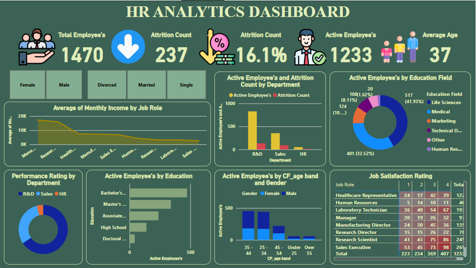
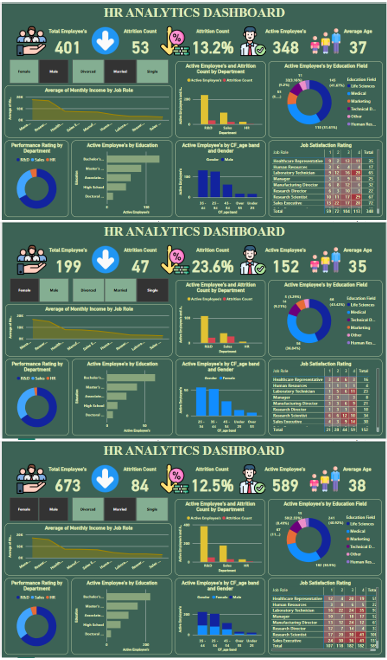

# Interactive HR_Analytics_PowerBI_Dashboard | Attrition, Performance & Workforce Insights
This project presents a dynamic and visually engaging HR analytics dashboard built in Power BI using sample employee data. It helps in understanding workforce trends, attrition patterns, employee demographics, and performance distribution.

## 🚀 Key Dashboard Insights

- **Overall KPIs (Card Visuals)**:
  - Total Employees
  - Attrition Count & Percentage
  - Active Employees
  - Average Employee Age

- **Breakdowns & Trends**:
  - Active Employees vs. Attrition by Department
  - Active Employees by Education Field
  - Performance Rating Distribution by Department
  - Active Employees by Education Degree
  - Active Employees by Age Band & Gender
  - Job Satisfaction Rating Overview

- **Interactive Filters (Slicers)**:
  - Gender (Male/Female)
  - Marital Status (Single / Married / Divorced)
  - Department, Job Role, Education Level, Age Band, etc.

## 🧩 Visual Types Used

- Card Visuals
- Pie Charts
- Clustered Bar Charts
- Matrix/Table with Conditional Formatting
- Heat Map Trends
- Slicers with Stylized Formatting
- Graphic Icons

## 🗃️ Dataset

- Sample HR dataset available online
> Note: This is synthetic data intended for practice and demonstration purposes only.

## 🛠️ Tools Used

- Power BI Desktop
- Basic DAX Measures (for Attrition %, Counts, and Filtering)
- Excel (for initial data cleanup)

## 🎯 Project Goal

To provide a 360° view of HR metrics, allowing stakeholders and HR professionals to analyze attrition patterns, track employee performance, and evaluate workforce demographics through an interactive Power BI dashboard.

## 📁 Repository Includes

- `HR_Analytics_PowerBI_Dashboard.pbix` – Power BI file
- `README.md` – Dashboard overview

##  

---

### 📽️ Inspired By:

- YouTube: [The Data Science Studio – HR Dashboard in Power BI](https://www.youtube.com/watch?v=vkUXAKqbEjY)

